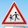
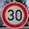
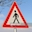
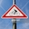

# **Traffic Sign Recognition** 

## Writeup

**Build a Traffic Sign Recognition Project**

The goals / steps of this project are the following:
* Load the data set (see below for links to the project data set)
* Explore, summarize and visualize the data set
* Design, train and test a model architecture
* Use the model to make predictions on new images
* Analyze the softmax probabilities of the new images
* Summarize the results with a written report

## Rubric Points
### Here I will consider the [rubric points](https://review.udacity.com/#!/rubrics/481/view) individually and describe how I addressed each point in my implementation.  

---
### Writeup / README

#### 1. Provide a Writeup / README that includes all the rubric points and how you addressed each one. You can submit your writeup as markdown or pdf. You can use this template as a guide for writing the report. The submission includes the project code.

You're reading it! and here is a link to my [project code](https://github.com/craigcode/Traffic-Sign-Classifier/blob/master/Traffic_Sign_Classifier.ipynb)

### Data Set Summary & Exploration

#### 1. Provide a basic summary of the data set. In the code, the analysis should be done using python, numpy and/or pandas methods rather than hardcoding results manually.

I used "numpy" methods to calculate summary statistics of the traffic
signs data set:

* The size of training set is 34799
* The size of the validation set is 4410
* The size of test set is 12630
* The shape of a traffic sign image is 32 x 32 x 3
* The number of unique classes/labels in the data set is 43

#### 2. Include an exploratory visualization of the dataset.

Here is an exploratory visualization of the data set. It is a bar chart showing the dataset distribution by class.

### Design and Test a Model Architecture

#### 1. Describe how you preprocessed the image data. What techniques were chosen and why did you choose these techniques? Consider including images showing the output of each preprocessing technique. Pre-processing refers to techniques such as converting to grayscale, normalization, etc. (OPTIONAL: As described in the "Stand Out Suggestions" part of the rubric, if you generated additional data for training, describe why you decided to generate additional data, how you generated the data, and provide example images of the additional data. Then describe the characteristics of the augmented training set like number of images in the set, number of images for each class, etc.)

As I had learned from the LeNet Lab earlier in the course, I pre-processed the images
by converting them to grayscale and normalizing them.

Initially, I had problems meeting the criteria of 0.93 test accuracy regardless
of how  I manipulated hyperparameters, epochs or batch size so I decided to augment the 
data so that there was a minimum of 1000 of samples for each class and this gave me favourable results.

I used stock transformations from the cv2 image library to transform, scale and 
alter brightness to create modified additional images. 

#### 2. Describe what your final model architecture looks like including model type, layers, layer sizes, connectivity, etc.) Consider including a diagram and/or table describing the final model.

My final model consisted of the following layers:

| Layer         		|     Description	        					| 
|:---------------------:|:---------------------------------------------:| 
| Input         		| 32x32x1 Grayscale image   					| 
| Convolution        	| Layer 1: Input = 32x32xc Output = 28x28x6.    |
| RELU Activation		|												|
| Pooling   	      	| Input = 28x28x6. Output = 14x14x6 			|
| Convolution   	    | Layer 2: Output = 10x10x16.      				|
| RELU Activation		|												|
| Pooling   	      	| Input = 10x10x16. Output = 5x5x16. 			|
| Flatten				| Input = 5x5x16. Output = 400.        			|
| Fully Connected		| Input = 400. Output = 120.        			|
| RELU Activation		|												|
| Dropout       		| Keep probability = 0.5						|
| Fully Connected		| Input = 120. Output = 84.         			|
| RELU Activation		|												|
| Dropout       		| Keep probability = 0.5						|
| Fully Connected		| Input = 84. Output = 43.            			|

  

#### 3. Describe how you trained your model. The discussion can include the type of optimizer, the batch size, number of epochs and any hyperparameters such as learning rate.

To train the model, I used a many combinations of hyperparameters, learning rates and batch sizes which didn't match the test accuracy of 0.93+ I needed.
After including data augmentation, and still failing, I added two dropout layers (a single one didn't have the desired effect) which got me to the target accuracy.

#### 4. Describe the approach taken for finding a solution and getting the validation set accuracy to be at least 0.93. Include in the discussion the results on the training, validation and test sets and where in the code these were calculated. Your approach may have been an iterative process, in which case, outline the steps you took to get to the final solution and why you chose those steps. Perhaps your solution involved an already well known implementation or architecture. In this case, discuss why you think the architecture is suitable for the current problem.

I used the LeNet model architecture that had proven successful in the lab with 
the MNIST image set, a very similar case study.

This was modifed to handle grayscale images and the 43 classes of image type.

Adding dropout layers and implemented validation-based early stopping (I tracked
my best validation accuracy above the 0.93 threshold and used that model)

My final model results were:

* training set accuracy = 0.999
* validation set accuracy = 0.969
* test set accuracy = 0.950

 

### Test a Model on New Images

#### 1. Choose five German traffic signs found on the web and provide them in the report. For each image, discuss what quality or qualities might be difficult to classify.

Here are five German traffic signs that I found on the web:

 
 

 

The last image might be difficult to classify because it has a stylized figure on it rather than the typical bicycle-only iconography.

#### 2. Discuss the model's predictions on these new traffic signs and compare the results to predicting on the test set. At a minimum, discuss what the predictions were, the accuracy on these new predictions, and compare the accuracy to the accuracy on the test set (OPTIONAL: Discuss the results in more detail as described in the "Stand Out Suggestions" part of the rubric).

Here are the results of the prediction:

| # | Image			        |     Prediction	        					| 
|:-:|:---------------------:|:---------------------------------------------:| 
| 1 | Children Crossing     | Children Crossing   							| 
| 2 | Speed Limit (30km/h)  | Speed Limit (30km/h) 							|
| 3 | Pedestrians			| Pedestrians									|
| 4 | Stop  	      		| Stop      					 				|
| 5 | Bicycles Crossing		| Dangerous curve to the left          			|

The model was able to correctly guess 4 of the 5 traffic signs, which gives an accuracy of 80%. 

#### 3. Describe how certain the model is when predicting on each of the five new images by looking at the softmax probabilities for each prediction. Provide the top 5 softmax probabilities for each image along with the sign type of each probability. (OPTIONAL: as described in the "Stand Out Suggestions" part of the rubric, visualizations can also be provided such as bar charts)

The softmax probabilities for each of the new images displayed surprising certainty in each case with the exception of the 5th which proved wrong but with a spread of
prediction.

Image 1:

| Probability         	|     Prediction	        					| 
|:---------------------:|:---------------------------------------------:| 
| 1.00         			| Children crossing   							| 
| 0.00    				| Ahead only         							|
| 0.00					| Right-of-way at the next intersection			|
| 0.00	      			| Dangerous curve to the right			 		|
| 0.00				    | Speed limit (20km/h)      					|

Image 2:

| Probability         	|     Prediction	        					| 
|:---------------------:|:---------------------------------------------:| 
| 1.00         			| Speed limit (30km/h)   						| 
| 0.00    				| Speed limit (50km/h) 							|
| 0.00					| Turn left ahead   							|
| 0.00	      			| End of speed limit (80km/h)			 		|
| 0.00				    | Right-of-way at the next intersection    		|

Image 3:

| Probability         	|     Prediction	        					| 
|:---------------------:|:---------------------------------------------:| 
| 1.00         			| Pedestrians              						| 
| 0.00    				| Road narrows on the right 					|
| 0.00					| Traffic signals   							|
| 0.00	      			| General Caution   					 		|
| 0.00				    | Right-of-way at the next intersection    		|

Image 4:

| Probability         	|     Prediction	        					| 
|:---------------------:|:---------------------------------------------:| 
| 1.00         			| Stop                    						| 
| 0.00    				| Yield              							|
| 0.00					| Turn Left Ahead   							|
| 0.00	      			| Turn Right Ahead  					 		|
| 0.00				    | Go straight or left         					|

Image 5:

| Probability         	|     Prediction	        					| 
|:---------------------:|:---------------------------------------------:| 
| 0.64       			| Dangerous curve to the left      				| 
| 0.28   				| Children crossing 							|
| 0.04  				| Bicycles crossing 							|
| 0.01         			| Slippery Road     					 		|
| 0.01		    	    | Keep Left                     				|

